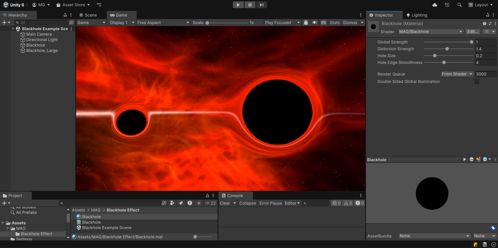

# Blackhole Effect Shader  

Read a tutorial on this at: https://medium.com/@mariosubspace/blackhole-shader-in-unity-eb7d93af9577

  

## Content  

### Blackhole_URP_Unity-6  
Updated project and shader for URP using Unity 6.  
- Handwritten shader has copious comments to describe what's going on.  
- The new URP `_CameraOpaqueTexture` texture does not include other transparent objects, so multiple blackholes do not blend with each other like they did before.  
- Added a `Global Strength` parameter to control the overall effect.  
- Added screen-based derivative anti-aliasing to the hole edge.  
- If you copy the shader into your project, your URP Pipeline Asset must have `Opaque Texture` enabled.  
- Look under `Assets/MAG/Blackhole Effect`   

### Blackhole_Unity-2017
Legacy shader using Built-in pipeline.  
- Old version used Shader Forge and is not very readable. Shader Forge is also no longer available.  
- Should still work if you are using the Legacy Built-In Pipeline.  
- Look under `Assets/MAG/Blackhole Effect`   
- Probably ignore "Gradient Smoothing", I am not sure I had finished that one.  
